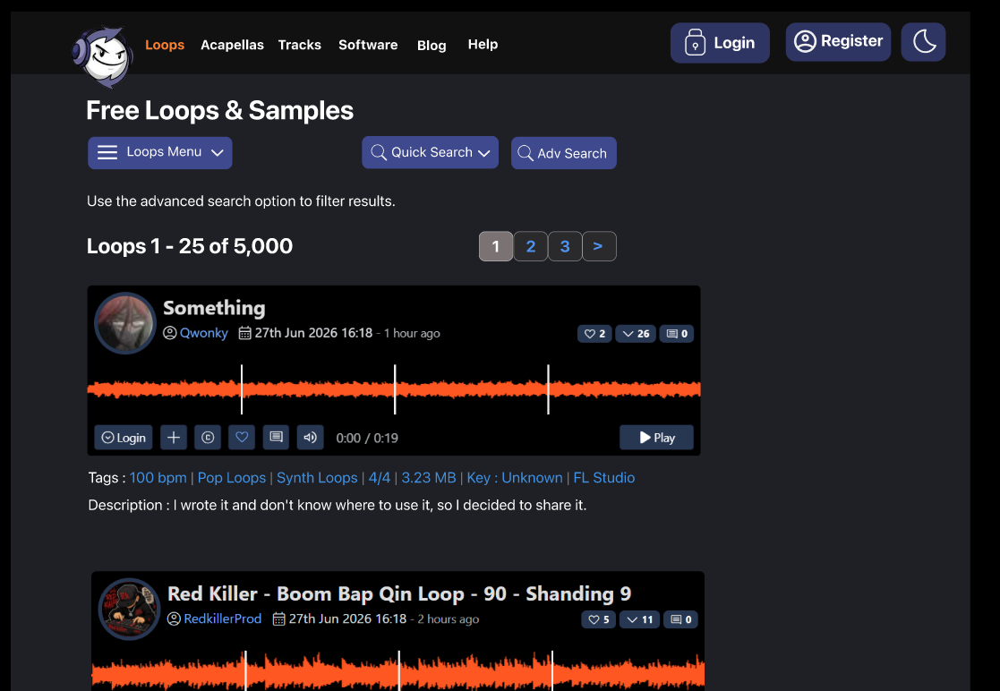
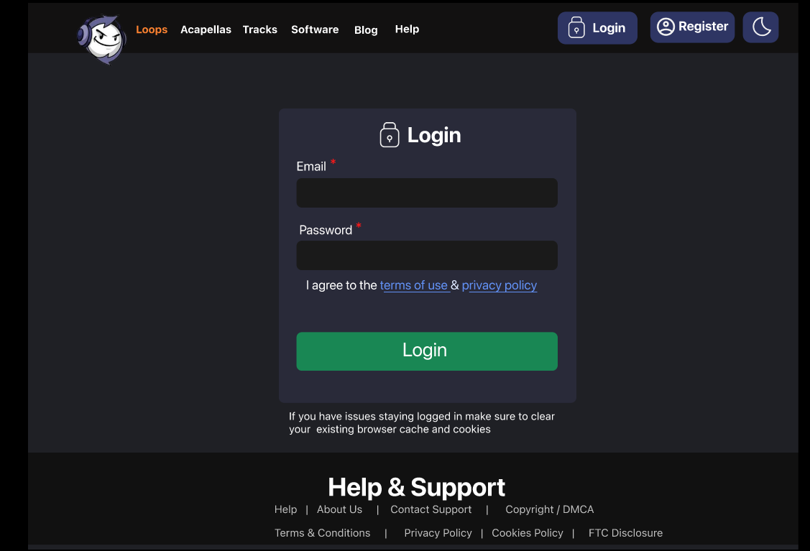
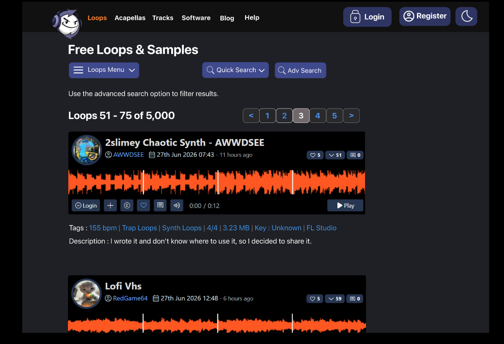

# 🎵 Looperman Website UI Clone

<p align="center">
  <b>A modern UI/UX clone of the Looperman website designed in Figma.</b><br>
  Focused on responsive layouts, interactive prototyping, clean user experience, and pixel-perfect interface recreation.
</p>

<p align="center">
<a href="https://www.figma.com/proto/EjdqUGtnsxSnDd5UcwPv0r/clone-ui?node-id=116-167&p=f&t=opu4gKJ41WzjVjXK-1&scaling=scale-down&content-scaling=fixed&page-id=0%3A1&starting-point-node-id=116%3A167">

</a>
</p>

---

# 📖 About the Project

This project is a **UI/UX recreation of the Looperman website**, designed entirely in **Figma**.

The objective was to replicate the original website while improving design consistency, understanding modern web layouts, and practicing interactive prototyping techniques.

The project demonstrates responsive web interface design, reusable components, user-friendly navigation, and interactive user flows.

---

# 🎯 Project Goals

- Recreate the Looperman website interface
- Practice pixel-perfect UI design
- Improve web layout skills
- Create realistic user interactions
- Build an interactive prototype
- Enhance visual hierarchy and usability

---

# ✨ Features

- 🎵 Homepage Design
- 🔐 Login Interface
- 🎧 Music Loop Cards
- 🔍 Search Bar
- 📂 Navigation Menu
- 📑 Pagination
- 🌙 Dark Theme
- 🎛 Responsive Web Layout
- 🎬 Interactive Prototype

---

# 🎨 UX & Prototype Interactions

This prototype includes interactive elements to simulate a real website experience.

- 🖱 Clickable navigation buttons
- 📄 Navigation between multiple pages
- 🎯 Interactive prototype flow
- 🔄 Smooth page transitions
- 🎼 Realistic music listing interface
- 📱 User-friendly web navigation

---

# 🛠️ Design Tools

- Figma
- Auto Layout
- Components
- Variants
- Interactive Prototyping

---

# 💼 Skills Demonstrated

- UI Design
- UX Design
- Website Design
- Web Layout Design
- Interactive Prototyping
- Auto Layout
- Components
- Variants
- Design Systems
- Visual Hierarchy
- Typography
- Color Theory
- Responsive Design
- Pixel-Perfect Design

---

# 📸 Project Screens

## 🏠 Homepage



---

## 🎵 Homepage (Pagination)


---

## 🔐 Login Page



---

## 📂 Navigation & Additional Page




---

# 🎥 Prototype Walkthrough

A complete interactive prototype walkthrough is included in this repository.

**File:** `assets/prototype-demo.mp4`

---

# 🔗 Live Figma Prototype

### Explore the interactive prototype here

https://www.figma.com/proto/EjdqUGtnsxSnDd5UcwPv0r/clone-ui?node-id=116-167&p=f&t=opu4gKJ41WzjVjXK-1&scaling=scale-down&content-scaling=fixed&page-id=0%3A1&starting-point-node-id=116%3A167

---

# 📂 Repository Structure

```
looperman-ui-clone
│
├── assets/
│   ├── homepage.png
│   ├── homepage-page2.png
│   ├── login-page.png
│   ├── navigation-page3.png
│   └── prototype-demo.mp4
│
└── README.md
```

---

# 🚀 Future Improvements

- Responsive Mobile Version
- Light Theme
- Music Player Animation
- Hover Effects
- Search Suggestions
- User Dashboard
- Upload Interface
- Playlist UI
- Micro-interactions
- Additional Prototype Animations

---

# 👩‍💻 Designed By

## Sakshi Bari

**Computer Engineering Student • UI/UX Designer • Frontend Enthusiast**

---

# 🌐 Connect With Me

**GitHub**

https://github.com/SakshiBari18

**LinkedIn**

https://www.linkedin.com/in/sakshibari-/

---

## ⭐ Support

If you like this project, consider giving it a ⭐ on GitHub.

Your support motivates me to continue designing and sharing more UI/UX projects.

---

<p align="center">
Designed  using Figma
</p>
